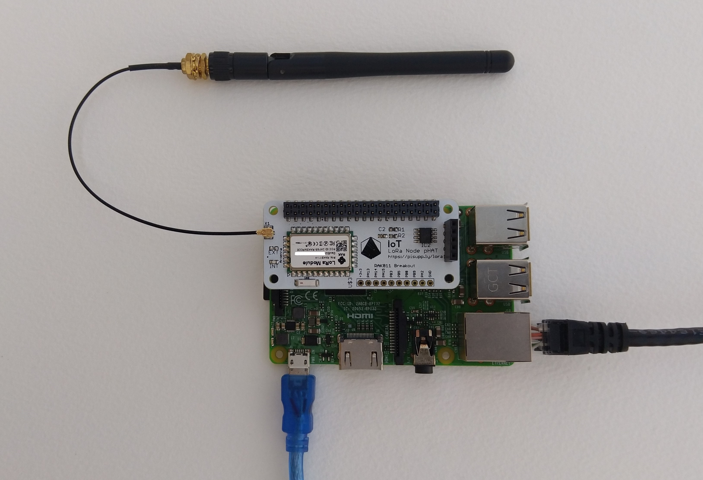
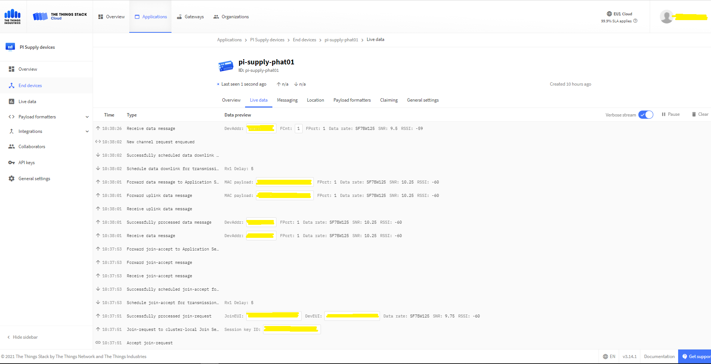

# RAK811LoRaWAN-NetCore
A C# library for [LoRaWAN](https://lora-alliance.org/about-lorawan) connectivity for [RAKwireless](https://www.rakwireless.com/en-us) [RAK811 Module](https://store.rakwireless.com/products/rak811-lpwan-module) equipped [.Net Core 5](https://dotnet.microsoft.com/) powered devices.

This repo has the source code for the series of blog posts written as I ported my [.NET nanoFramework RAK811 LoRaWAN library](https://github.com/KiwiBryn/RAK811LoRaWAN-NetNF) to .Net Core 5.

01. [Basic connectivity](http://blog.devmobile.co.nz/2021/09/04/net-core-rak811-lorawan-library-part1/)
02. [Nasty OTAA connect](http://blog.devmobile.co.nz/2021/09/05/net-core-rak811-lorawan-library-part2/)

I used a [PI Supply IoT LoRa Node pHAT for Raspberry Pi](https://uk.pi-supply.com/products/iot-lora-node-phat-for-raspberry-pi) for development

[The Things Network](https://www.thethingsnetwork.org/) uplink and downlink messaging 

I used a local [RAK7258 WisGate Edge Lite](https://store.rakwireless.com/collections/wisgate-edge/products/rak7258-micro-gateway) connected to [The Things Network](https://www.thethingsnetwork.org/) to test my implementation.

